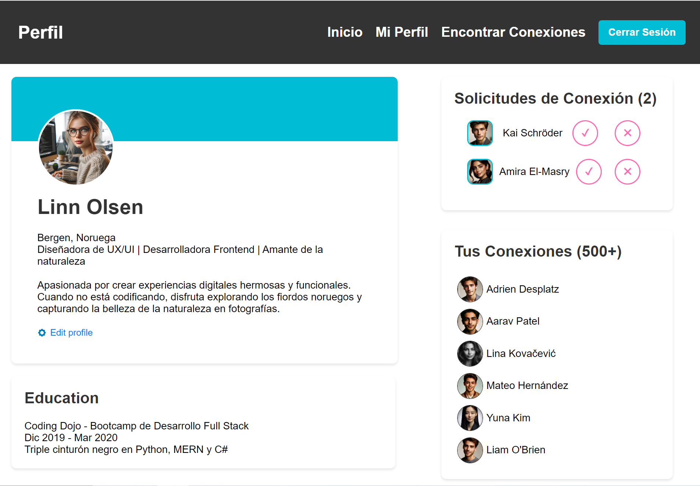
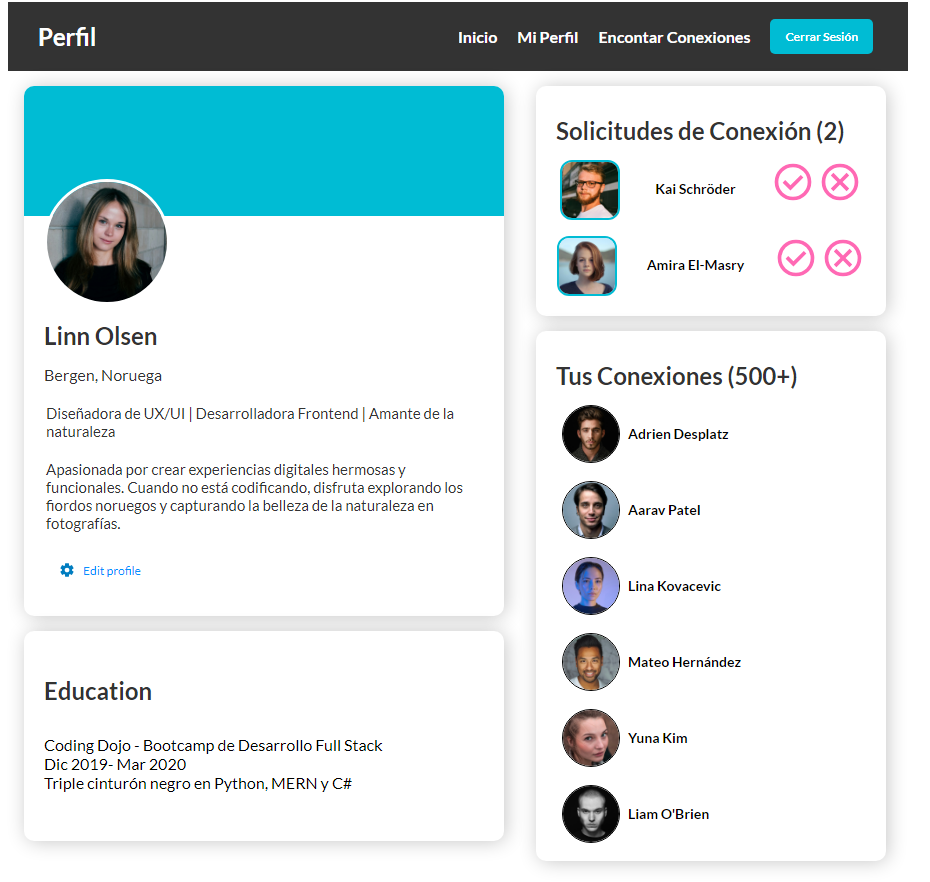

# Página de Perfil de Usuario

Esta es una página de perfil de usuario diseñada para mostrar la información personal, conexiones y solicitudes de conexión de un usuario. La página está estructurada con HTML y estilizada con CSS.

## Vista del Modelo

Aquí puedes ver la imagen del modelo que se utilizó como referencia:

## Vista Codificada

A continuación, se muestra la imagen del resultado obtenido:

## Estructura del Proyecto

El proyecto se compone de las siguientes secciones:

- **Header**: Contiene la barra de navegación con enlaces a Inicio, Mi Perfil, Encontrar Conexiones y Cerrar Sesión.
- **Main**: Incluye dos secciones principales:
  - **Section Izquierdo**: Información del usuario y educación.
  - **Aside Derecho**: Solicitudes de conexión y conexiones del usuario.
 
## Tecnologías Utilizadas
- HTML5: Para la estructura del contenido.
- CSS3: Para el diseño y estilizado de la página.